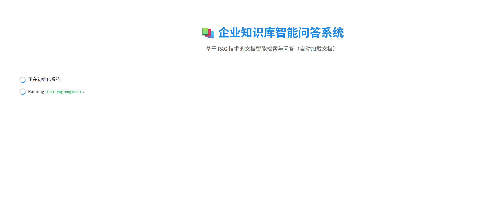
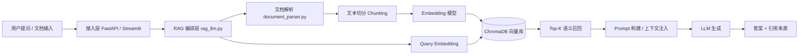

# 1. 项目名称

**企业知识库 RAG 智能问答系统（Enterprise Knowledge RAG Assistant）**

> 面向企业文档场景的检索增强生成系统，支持多格式文档接入、语义检索、上下文问答与容器化交付。

---

# 2. Demo 展示

## Docker 方式访问入口（推荐）

```bash
docker compose up -d
```

启动后访问：
- Web UI（Streamlit）：`http://localhost:8501`
- API 服务（FastAPI）：`http://localhost:8001`
- 健康检查：`http://localhost:8001/health`

## 演示资源



.png)

.png)

# 3. 项目背景

企业制度、流程、产品资料通常分散在 PDF/Word/TXT 文档中，传统关键词检索存在如下问题：

- 语义相关问题难以命中
- 文档更新快，人工维护问答成本高
- 一线人员查询链路长，知识复用效率低

本项目目标：将非结构化文档转化为可检索知识库，通过“语义召回 + 大模型生成”提供可追溯、可复用的知识问答能力。

---

# 4. 核心功能亮点

## 4.1 多格式文档接入
- 支持 `PDF / DOCX / DOC / TXT`
- 自动完成解析、切分、向量化、入库

## 4.2 语义检索增强问答
- Query 向量化后在 ChromaDB 做相似度检索
- 将召回片段注入 Prompt，提升回答相关性与稳定性

## 4.3 答案来源可追溯
- 返回引用文档及相似度分数
- 便于核验答案依据

## 4.4 知识库治理能力
- 重建：`POST /api/rebuild`
- 清空：`DELETE /api/clear`
- 统计：`GET /api/stats`

## 4.5 工程化交付
- FastAPI + Streamlit 双入口
- Docker Compose 一键启动
- 配置解耦，便于多环境部署

---

# 5. 技术架构

## 5.1 架构图（组件与数据流）



## 5.2 组件说明
- **接入层**：接收查询、上传与管理请求
- **编排层**：串联检索、Prompt 构建、LLM 调用
- **解析层**：文档文本抽取与清洗
- **向量层**：向量持久化与近邻检索
- **模型层**：Embedding 表征语义，LLM 负责回答生成

---

# 6. 技术栈

- **语言**：Python 3.10+
- **后端**：FastAPI、Uvicorn
- **前端展示**：Streamlit
- **RAG 相关**：LangChain、ChromaDB
- **Embedding**：DashScope OpenAI-compatible Embedding API（可替换）
- **LLM**：Qwen（DashScope OpenAI-compatible API）
- **文档解析**：PyPDF2、python-docx
- **容器化**：Docker、Docker Compose

---

# 7. 部署与使用

## 7.1 环境变量配置

复制 `.env.example` 为 `.env`：

```bash
cp .env.example .env
```

配置示例：

```env
EMBEDDING_MODEL=text-embedding-v3
EMBEDDING_API_BASE=https://dashscope.aliyuncs.com/compatible-mode/v1
EMBEDDING_API_KEY=your_api_key

LLM_MODEL=qwen2.5-7b-instruct
LLM_API_BASE=https://dashscope.aliyuncs.com/compatible-mode/v1
LLM_API_KEY=your_api_key
```

## 7.2 Docker 启动（推荐）

```bash
docker compose up -d
```

常用命令：

```bash
# 查看状态
docker compose ps

# 查看日志
docker compose logs --tail 100 api
docker compose logs --tail 100 web

# 停止服务
docker compose down
```

## 7.3 本地运行（可选）

```bash
python -m venv .venv
.venv\Scripts\activate
pip install -r requirements.txt
python main.py
streamlit run streamlit_app.py
```

---

# 8. 项目结构

```text
.
├── main.py
├── streamlit_app.py
├── rag_llm.py
├── vector_store.py
├── document_parser.py
├── config.py
├── requirements.txt
├── Dockerfile
├── docker-compose.yml
├── .dockerignore
├── .env.example
├── README.md
├── PROJECT_SHOWCASE.md
├── data/
│   ├── documents/
│   ├── chroma_db/            # 运行后生成
│   └── ingest_state.json
├── models/
├── demo.png
├── demo (2).png
└── demo (3).png
```

> 当前部署依赖以 `requirements.txt` 为准。

---

# 9. 性能与优化

## 9.1 已完成优化
- 分块参数可配置（`CHUNK_SIZE` / `CHUNK_OVERLAP`）
- 向量库持久化，减少重复构建成本
- 自动导入与缓存签名机制，避免无效重建
- Top-K 与阈值可调，平衡召回率与噪声

## 9.2 建议展示指标
- 检索延迟（P50 / P95）
- 端到端响应耗时
- 召回命中率（Top-K）
- 答案一致性（与检索片段匹配程度）

## 9.3 可扩展方向
- 引入 Reranker 提升精排质量
- 混合检索（向量 + BM25）
- 建立评测集与自动回归评估
- 多租户与权限隔离
- 引入缓存层降低重复请求成本

---

# 10. 工程价值总结

- 提供从文档到问答服务的完整闭环能力
- 支持 API 集成与 Web 展示双场景
- 容器化部署降低环境差异，提升可复现性与可交付性
