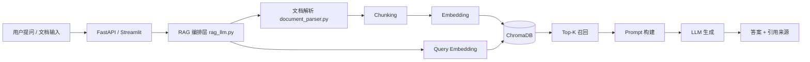

# 📚 企业知识库 RAG 智能问答系统

> 一个面向企业知识场景的 RAG（Retrieval-Augmented Generation）项目：支持多格式文档接入、语义检索、上下文问答、来源追溯与 Docker 一键部署。

---

## 🎯 项目概览

企业制度、流程、产品说明等知识通常分散在 PDF/Word/TXT 文档中，传统关键词检索常出现“命中不准、维护成本高、查询链路长”等问题。  
本项目通过 **语义检索 + 大模型生成** 构建可落地的知识问答闭环，实现：

- 将非结构化文档转为可检索知识库
- 将召回片段作为上下文约束回答
- 返回引用来源，提升答案可核验性

---

## ✨ 核心亮点

- 🧠 **完整 RAG 链路**：文档解析 → 文本切分 → 向量化入库 → 相似度召回 → 生成回答
- 📄 **多格式文档支持**：`PDF / DOCX / DOC / TXT`
- 🔍 **语义检索增强**：支持 Top-K 召回、阈值过滤、上下文注入
- 🧾 **来源可追溯**：输出引用文档及相似度分数
- 🧰 **知识库治理能力**：重建 / 清空 / 统计接口齐全
- 🖥️ **双入口交互**：FastAPI（接口集成）+ Streamlit（可视化展示）
- 🐳 **容器化交付**：Docker Compose 一键启动，便于复现

---

## 🖼️ Demo 展示

### 访问入口（Docker 启动后）

```bash
docker compose up -d
```
启动后访问：
- 🌐 Web UI：`http://localhost:8501`
- 🔌 API：`http://localhost:8001`
- ✅ 健康检查：`http://localhost:8001/health`

### 效果截图


.png)

.png)


---

## 🧱 技术架构（简述）



### 组件说明

- **接入层（FastAPI/Streamlit）**：接收问答请求、文档上传与管理操作
- **编排层（rag_llm.py）**：组织检索流程、构建 Prompt、调用 LLM
- **解析层（document_parser.py）**：文档文本抽取、清洗与切分
- **向量层（vector_store.py + ChromaDB）**：向量存储、相似度检索、持久化
- **模型层（Embedding + LLM）**：语义表示与回答生成

---

## 🛠️ 技术栈

- **语言**：Python 3.10+
- **后端**：FastAPI、Uvicorn
- **前端展示**：Streamlit
- **RAG 组件**：LangChain、ChromaDB
- **LLM 调用**：OpenAI-compatible API（Qwen / DashScope）
- **文档处理**：PyPDF2、python-docx
- **文本处理**：jieba
- **工程化**：Docker、Docker Compose

---

## 🚀 部署与使用

### A. Docker 方式（推荐）

#### 1) 准备环境变量

复制 `.env.example` 为 `.env`：

```bash
cp .env.example .env
```

示例配置：

```env
EMBEDDING_MODEL=text-embedding-v3
EMBEDDING_API_BASE=https://dashscope.aliyuncs.com/compatible-mode/v1
EMBEDDING_API_KEY=your_api_key

LLM_MODEL=qwen2.5-7b-instruct
LLM_API_BASE=https://dashscope.aliyuncs.com/compatible-mode/v1
LLM_API_KEY=your_api_key
```

#### 2) 启动服务

```bash
docker compose up -d
```

#### 3) 查看状态与日志

```bash
# 服务状态
docker compose ps

# API 日志
docker compose logs --tail 100 api

# Web 日志
docker compose logs --tail 100 web
```

#### 4) 停止服务

```bash
docker compose down
```

---

### B. 本地方式（可选）

```bash
python -m venv .venv
.venv\Scripts\activate
pip install -r requirements.txt
python main.py
streamlit run streamlit_app.py
```

---

## 🔌 常用 API

| 接口 | 方法 | 说明 |
|---|---|---|
| `/health` | GET | 健康检查 |
| `/api/upload` | POST | 上传文档 |
| `/api/query` | POST | 问答查询 |
| `/api/stats` | GET | 系统统计 |
| `/api/rebuild` | POST | 重建知识库 |
| `/api/clear` | DELETE | 清空知识库 |

---

## 🗂️ 项目结构

```text
.
├── main.py                      # FastAPI 服务入口
├── streamlit_app.py             # Streamlit 页面入口
├── rag_llm.py                   # RAG 主流程编排
├── vector_store.py              # 向量存储与检索封装
├── document_parser.py           # 文档解析与清洗
├── config.py                    # 配置管理
├── requirements.txt             # 最终部署依赖
├── Dockerfile
├── docker-compose.yml
├── .dockerignore
├── .env.example
├── README.md
├── PROJECT_SHOWCASE.md
├── data/
│   ├── documents/               # 原始文档
│   ├── chroma_db/               # 运行后生成的向量数据
│   └── ingest_state.json        # 自动导入状态
├── models/
├── demo.png
├── demo (2).png
└── demo (3).png
```

---

## ⚡ 性能与优化

### 已完成

- 可配置分块策略：`CHUNK_SIZE` / `CHUNK_OVERLAP`
- 向量库持久化，减少重复构建成本
- 文档签名缓存，避免无效重建
- Top-K 与相似度阈值可调，平衡召回与噪声

### 建议关注指标

- 检索延迟（P50 / P95）
- 端到端问答耗时
- Top-K 命中情况
- 回答与检索片段一致性

### 可扩展方向

- 引入 Reranker 提升精排质量
- 混合检索（向量 + BM25）
- 自动化评测集与回归评估
- 多租户权限隔离
- 缓存层（问答缓存 / 向量缓存）

---

## 📖 进一步阅读

更完整的展示说明（章节化版本）请查看：

- `PROJECT_SHOWCASE.md`

---

## 📄 License

MIT License
