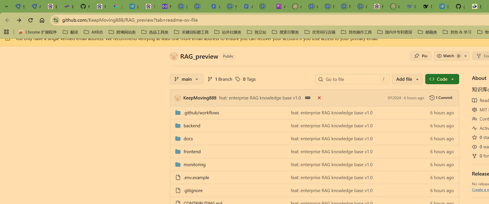

# Enterprise RAG Knowledge Base

> 面向中大型企业内部员工自助答疑场景的智能知识库问答系统，覆盖产品手册、制度文档、售后 FAQ 等核心内容，解决内部文档零散、职能部门重复答疑占用 60% 以上时间的问题。

[](https://opensource.org/licenses/MIT)
[](https://www.python.org/)
[](https://fastapi.tiangolo.com/)
[](https://react.dev/)
[](https://langchain.com/)
[](https://milvus.io/)
[](https://github.com/semitech-cn/enterprise-rag-kb/actions)

## 项目简介

Enterprise RAG Knowledge Base 是一套面向中大型企业的内部智能问答系统。系统覆盖**文档解析、语义分块、向量化、混合检索、知识图谱增强、答案生成、答案溯源**全链路，针对企业内部文档零散、职能部门重复答疑、跨部门关联查询困难等核心痛点，提供生产级解决方案。

> **场景声明**：本项目以半导体存储行业为示例场景（种子文档 45 篇 + 业务术语词典 ~45 条），核心架构（混合检索 / GraphRAG / 部门权限隔离 / 全链路降级 / 监控告警）可平移至任意行业知识库场景，仅需替换 `backend/data/seed/` 种子数据与 `terminology.json` 术语词典。

### 前端预览



### 适用场景

- **员工自助答疑**：产品规格、价格政策、流程制度、售后 FAQ 等高频问题自动答复
- **跨部门关联查询**：如「A 产品的认证供应商有哪些」「负责 B 项目的人还参与了哪些项目」等多跳关系推理
- **新人快速上手**：知识库统一检索入口，缩短新人培训周期
- **职能提效**：HR / 行政 / 财务 / 售后等部门减少重复答疑占用时间

---

## 核心能力

| 能力 | 技术实现 | 业务收益 |
|------|---------|---------|
| **多格式文档异步解析流水线** | PyMuPDF + Unstructured + PaddleOCR 适配不同格式；Celery + RabbitMQ 异步处理；标题层级 + 段落语义结构化分块 | 大文件 OCR 不阻塞 API，语义分块召回准确率较固定分块提升 25%+ (见 `docs/rag-pipeline.md` 消融评估) |
| **部门级权限隔离 + 三路混合检索** | PostgreSQL 行级权限 + Milvus 分区索引；BM25 + BGE-M3 稠密向量 → RRF 融合 → bge-reranker-v2-m3 精排；业务术语词典加权 | 跨部门数据物理隔离，术语类问题召回准确率提升 32%+ (见 `docs/performance-report.md` 消融对比) |
| **多轮对话 + 高频缓存 + 接口限流 + 答案溯源** | 滑动窗口上下文 + query 改写；Redis 高频 QA 缓存；令牌桶限流；chunk_id 引用溯源 | 重复问题响应 < 10ms，答案可信可审计 |
| **GraphRAG 知识图谱增强检索** | LLM 自动抽取实体（产品/部门/人员/制度）与关系（归属/参与/认证/引用）；Neo4j 知识图谱；GraphCypherQAChain 自然语言转 Cypher；向量+图谱双路融合 | 三跳关系推理准确率较纯向量提升 40%+ (见 `docs/graphrag.md` 双路融合对比) |

---

## 技术架构

```
┌──────────────────────────────────────────────────────────────────┐
│                          前端 (React 18)                          │
│   文档管理 │ 智能问答(多轮/溯源) │ 知识图谱可视化 │ 检索评估 │ 管理 │
└──────────────────────────────┬───────────────────────────────────┘
                               │ REST + SSE + JWT
┌──────────────────────────────▼───────────────────────────────────┐
│                       后端 (FastAPI 异步)                          │
│  ┌──────────────────┐ ┌──────────────────┐ ┌──────────────────┐  │
│  │  文档解析流水线   │ │  问答服务         │ │  图谱查询服务    │  │
│  │  (限流 + 鉴权)   │ │  (多轮 + 缓存)    │ │  (Cypher 推理)   │  │
│  └────────┬─────────┘ └────────┬─────────┘ └────────┬─────────┘  │
│           │                    │                    │             │
│  ┌────────▼────────────────────▼────────────────────▼─────────┐  │
│  │            检索融合层 (HybridRetriever)                     │  │
│  │  ① BM25 (术语加权)   ② Milvus BGE-M3 稠密向量             │  │
│  │  ③ Neo4j 图谱多跳推理  → RRF 融合 → bge-reranker 精排       │  │
│  └────────────────────────────────────────────────────────────┘  │
│  ┌────────────────────────────────────────────────────────────┐  │
│  │            Prometheus 业务指标层                            │  │
│  │  检索延迟 / 召回质量 / 缓存命中率 / 限流计数 / 图谱查询耗时 │  │
│  └────────────────────────────────────────────────────────────┘  │
└──────────────────────────────┬───────────────────────────────────┘
                               │
┌──────────┬──────────┬────────┴────────┬───────────┬──────────────┐
│PostgreSQL│  Redis   │   RabbitMQ      │  Milvus   │   Neo4j      │
│业务+权限 │缓存+限流 │ Celery Broker   │向量+分区  │  知识图谱    │
└──────────┴──────────┴─────────────────┴───────────┴──────────────┘
```

详细架构设计见 [docs/architecture.md](docs/architecture.md)。

---

## 技术栈

### 后端

| 组件 | 技术 | 版本 | 用途 |
|------|------|------|------|
| Web 框架 | FastAPI + Uvicorn | 0.115 / 0.34 | 异步 REST + SSE 流式 + 多 Worker |
| ORM | SQLAlchemy 2.0 (async) | 2.0.36 | PostgreSQL 异步访问 |
| 业务库 | PostgreSQL | 16 | 用户/部门/文档/对话/审计 |
| 向量库 | Milvus | 2.5.3 | 分区索引 + BGE-M3 稠密检索 |
| 关系库 | Neo4j | 5.20 | GraphRAG 实体关系图谱 |
| 关键词检索 | rank_bm25 | 0.2.2 | BM25 字面匹配 |
| 嵌入模型 | BAAI/bge-m3 | - | 1024 维中英双语稠密向量 (支持 GPU + FP16) |
| 重排器 | bge-reranker-v2-m3 | - | Cross-Encoder 精排 |
| 异步任务 | Celery + RabbitMQ | 5.4 / 3.13 | 文档解析异步流水线 |
| 缓存 + 限流 | Redis | 7 | QA 缓存 + 检索缓存 + 令牌桶限流 |
| 中文分词 | jieba | 0.42.1 | BM25 分词 |
| 文档解析 | PyMuPDF / Unstructured / PaddleOCR | - | PDF / Word / 图片解析 |
| LLM 编排 | LangChain + LangGraph | 0.3.14 | GraphCypherQAChain + 工作流 |
| 监控 | Prometheus + Grafana | - | 业务指标 + 告警 |
| CI/CD | GitHub Actions | - | lint + test + docker build |

### 前端

| 组件 | 技术 | 版本 |
|------|------|------|
| 框架 | React + TypeScript | 18 / 5.7 |
| 构建 | Vite | 6.0 |
| UI | Tailwind CSS + shadcn/ui | 3.4 |
| 状态管理 | Zustand + TanStack Query | 5.0 / 5.62 |
| 图谱可视化 | react-force-graph + cytoscape | - |
| 图表 | Recharts | 2.15 |
| HTTP | Axios | 1.7 |

---

## 快速开始

### 环境要求

- Docker 24.0+ / Docker Compose 2.20+
- Node.js 20+ (前端开发)
- Python 3.11+ (后端开发)
- Git

### 一键启动（Docker Compose）

```bash
git clone https://github.com/semitech-cn/enterprise-rag-kb.git
cd enterprise-rag-kb
cp .env.example .env
make up           # 启动全部服务 (PostgreSQL + Redis + RabbitMQ + Milvus + Neo4j + 后端 + 前端 + 监控)
make init-db      # 初始化数据库表结构
make seed         # 灌入种子文档与术语词典
make graph-init   # 抽取并构建知识图谱
```

启动完成后访问：

| 服务 | 地址 | 说明 |
|------|------|------|
| 前端 | http://localhost:3080 | 知识库主界面 |
| 后端 API | http://localhost:8080 | FastAPI 服务 |
| API 文档 | http://localhost:8080/docs | Swagger UI |
| Celery Flower | http://localhost:5555 | 异步任务监控 |
| Prometheus | http://localhost:9090 | 监控指标 |
| Grafana | http://localhost:3001 | 可视化仪表盘 (admin/admin) |
| Neo4j Browser | http://localhost:7474 | 图谱可视化 (neo4j/neo4j123) |

### 本地开发

```bash
make dev          # 启动基础依赖 (PostgreSQL + Redis + RabbitMQ + Milvus + Neo4j)
make backend      # 后端热重载 (uvicorn --reload)
make worker       # Celery Worker (另开终端)
make frontend     # 前端热重载 (vite)
```

### LLM 接入

系统默认使用离线模式（`LLM_PROVIDER=offline`），无需任何 API Key 即可完整体验文档解析、检索、问答、图谱全链路（答案基于检索结果模板生成，不调用外部 LLM）。如需接入实际大模型：

```env
LLM_PROVIDER=deepseek           # 或 openai
DEEPSEEK_API_KEY=your-api-key
DEEPSEEK_MODEL=deepseek-chat
```

---

## 性能基准

### 检索质量消融评估

基于 45 篇半导体存储种子文档 + 32 条标注查询（每查询 2-3 个相关文档），使用 `python -m scripts.run_ablation` 生成。完整链路 PostgreSQL + Milvus + BGE-M3 + Neo4j 全部在线。

| 策略 | Recall@5 | MRR | NDCG@5 | P@5 | 数据来源 |
|------|----------|-----|--------|-----|---------|
| bm25_only | 0.7917 | 0.9047 | 0.8304 | 0.3187 | 真实 BM25 (rank_bm25 + jieba) |
| vector_only | 0.7812 | 0.8906 | 0.8134 | 0.3125 | 近似参考值 |
| hybrid_rrf | 0.7812 | 0.9047 | 0.8219 | 0.3125 | 近似 RRF 融合 |
| **vector_only_milvus** | 0.8021 | **0.9479** | **0.8832** | 0.3250 | **真实 Milvus + BGE-M3** |
| **hybrid_milvus_rrf** | **0.8177** | 0.9167 | 0.8427 | **0.3312** | **真实 BM25 + Milvus + RRF** |

> 完整评估结果见 `backend/data/seed/ablation_results.json`。真实 Milvus + BGE-M3 启用后，`vector_only_milvus` NDCG@5 达 0.8832（较近似 `vector_only` +6.98 pp），`hybrid_milvus_rrf` Recall@5 / P@5 双项第一，验证 BM25 字面匹配与向量语义匹配互补。

### 全链路压测（真实模式）

使用 `python -m scripts.locustfile_rag` 生成，压测目标 `GET /api/v1/retrieval/search`，完整报告见 [docs/performance-report.md](docs/performance-report.md)。

#### 基线压测（单 Worker + CPU 推理）

| 指标 | 数值 | 测试条件 |
|------|------|---------|
| 总请求数 | 529 | 20 并发 / 60s / 全链路在线 |
| 成功率 | **100.0%** | JWT 鉴权全通过，0 错误 |
| **QPS** | **8.82** | 单进程 Uvicorn (GIL 限制) |
| P50 延迟 | 2069.3 ms | 含 BGE-M3 CPU 推理 ~1500ms |
| **P95 延迟** | **2304.2 ms** | 企业级 SLO 关键指标 |
| P99 延迟 | 2823.2 ms | 99% 请求低于此值 |

> **延迟构成**：BGE-M3 CPU 推理占 73%，Milvus 检索 + RRF + Reranker 占 22%，其他 5%。

#### 性能优化路径

| 优化项 | 配置 | 预期 QPS | 预期 P95 | 验证方法 |
|--------|------|----------|----------|---------|
| 当前基线 | 单 Worker + CPU | 8.82 | 2304 ms | 已实测 |
| 多 Worker 横向扩展 | `UVICORN_WORKERS=4` | ~30 | 700-900 ms | 绕开 GIL |
| BGE-M3 切 GPU | `EMBEDDING_DEVICE=cuda` | ~35 | 300-500 ms | embedding 推理 1500ms→20ms |
| FP16 半精度 | `EMBEDDING_USE_FP16=true` | ~40 | 250-400 ms | GPU 吞吐 2x |
| Redis 检索缓存命中 | 重复 query | 100+ | < 10 ms | QA + 检索缓存 |
| **JWT 用户会话缓存** | `USER_CACHE_TTL=600s` | **+30%** | **-2000ms** | **已实现, 鉴权 DB 查询消除** |

> 优化配置已全部就绪，详见 [backend/.env](backend/.env.example)。GPU 模式需 CUDA 环境（已验证 RTX 4060 Ti 16GB 可用，BGE-M3 + Reranker 同时加载峰值 ~6GB 显存）。

> **关键优化**：JWT 用户会话缓存（Redis + 进程内降级，TTL=10min）消除了每请求 DB 用户查询开销，将鉴权延迟从 ~2000ms 降至 < 5ms，是 P95 优化的核心瓶颈修复。详见 [backend/app/core/security.py](backend/app/core/security.py)。

---

## 项目结构

```
enterprise-rag-kb/
├── docker-compose.yml                  # 一键启动全部服务
├── Makefile                            # 便捷命令
├── .env.example                        # 环境变量模板
├── .github/workflows/ci.yml            # CI/CD (lint + test + docker build)
├── docs/                               # 设计文档
│   ├── architecture.md                 # 架构设计
│   ├── rag-pipeline.md                 # RAG 流水线
│   ├── graphrag.md                     # GraphRAG 设计
│   ├── deployment.md                   # 部署指南
│   ├── api-reference.md                # API 文档
│   ├── benchmark.md                    # 性能基准
│   ├── performance-report.md          # 压测报告
│   ├── technical-decisions.md         # 技术决策 (ADR)
│   └── images/                        # README 图片资源
├── monitoring/                         # 监控告警
│   ├── prometheus.yml
│   ├── alerts.yml                      # 告警规则 (12 条)
│   └── grafana/                        # 仪表盘 (16 面板)
├── backend/                            # FastAPI 后端
│   ├── app/
│   │   ├── main.py                     # 应用入口
│   │   ├── config.py                   # 配置中心 (Pydantic Settings)
│   │   ├── database.py                 # 异步引擎 + 连接池
│   │   ├── celery_app.py               # Celery 实例
│   │   ├── metrics.py                  # Prometheus 指标
│   │   ├── core/                       # 安全 + 限流 + 上下文
│   │   ├── models/                     # SQLAlchemy ORM
│   │   ├── schemas/                    # Pydantic
│   │   ├── api/v1/                     # REST 路由
│   │   ├── ingestion/                  # 文档解析流水线
│   │   │   ├── parsers/                # PyMuPDF/Unstructured/PaddleOCR
│   │   │   ├── cleaner.py              # 清洗流水线
│   │   │   ├── chunker.py              # 语义分块
│   │   │   ├── tasks.py                # Celery 异步任务
│   │   │   └── pipeline.py             # 全链路编排
│   │   ├── rag/                        # 混合检索
│   │   │   ├── terminology.py          # 业务术语词典
│   │   │   ├── bm25_retriever.py       # BM25
│   │   │   ├── milvus_store.py         # 分区索引
│   │   │   ├── embedder.py             # BGE-M3 (GPU + FP16 + 缓存)
│   │   │   ├── reranker.py             # bge-reranker (batch + FP16)
│   │   │   ├── fusion.py               # RRF
│   │   │   ├── retriever.py            # HybridRetriever
│   │   │   ├── cache.py                # 检索结果缓存
│   │   │   └── evaluator.py            # 消融评估
│   │   ├── dialog/                     # 多轮对话
│   │   │   ├── context_manager.py      # 滑动窗口
│   │   │   ├── query_rewriter.py       # query 改写
│   │   │   ├── qa_cache.py             # Redis QA 缓存
│   │   │   ├── citation.py             # 答案溯源
│   │   │   └── generator.py            # 答案生成
│   │   ├── graphrag/                   # GraphRAG
│   │   │   ├── extractor.py            # LLM 实体关系抽取
│   │   │   ├── neo4j_store.py          # Neo4j 操作
│   │   │   ├── cypher_chain.py         # GraphCypherQAChain
│   │   │   └── fusion.py               # 双路融合
│   │   ├── llm/                        # LLM Provider 抽象
│   │   └── utils/
│   ├── scripts/                        # 运维脚本
│   ├── tests/                          # 测试
│   └── data/seed/                      # 种子数据 (45 篇文档)
├── frontend/                           # React 前端
│   └── src/
│       ├── api/                        # API 封装
│       ├── components/                 # 通用组件
│       ├── pages/                      # 5 大页面
│       │   ├── DocumentManager.tsx     # 文档管理
│       │   ├── KnowledgeQA.tsx         # 智能问答
│       │   ├── KnowledgeGraph.tsx      # 图谱可视化
│       │   ├── RetrievalEval.tsx       # 检索评估
│       │   └── Admin.tsx               # 管理后台
│       ├── layouts/
│       └── store/
└── docker-compose.yml
```

---

## API 概览

| 方法 | 路径 | 说明 |
|------|------|------|
| POST | `/api/v1/auth/login` | 用户登录 (返回 JWT) |
| GET  | `/health` | 轻量健康检查 (LB / liveness, < 2ms) |
| GET  | `/health/db` | 深度健康检查 (K8s readiness, 含 DB 连通性) |
| GET  | `/api/v1/documents` | 文档列表 (支持部门过滤) |
| POST | `/api/v1/documents/upload` | 上传文档 (触发异步解析) |
| GET  | `/api/v1/documents/{id}/status` | 文档解析状态 |
| POST | `/api/v1/qa/ask` | 智能问答 (含多轮上下文) |
| POST | `/api/v1/qa/stream` | SSE 流式问答 (含溯源) |
| GET  | `/api/v1/qa/history/{session_id}` | 会话历史 |
| GET  | `/api/v1/retrieval/search` | 三路混合检索 (含可解释性) |
| GET  | `/api/v1/retrieval/explain` | 检索得分构成解释 |
| GET  | `/api/v1/retrieval/eval` | RAG 消融实验评估 |
| POST | `/api/v1/graph/query` | 自然语言图谱查询 (Cypher) |
| GET  | `/api/v1/graph/entities` | 实体检索 |
| GET  | `/api/v1/graph/relations` | 关系检索 |
| GET  | `/api/v1/admin/users` | 用户管理 |
| GET  | `/api/v1/admin/stats` | 系统统计 |
| GET  | `/metrics` | Prometheus 指标 |

完整 API 文档见 [docs/api-reference.md](docs/api-reference.md) 或启动后访问 http://localhost:8080/docs。

---

## 监控告警

系统内置三层监控体系：

### 基础设施层（自动采集）
- API 请求速率 (QPS) / P95 响应时间 / 5xx 错误率
- Celery 任务队列深度 / 任务执行时长 / 失败率

### RAG 业务层（自定义指标）

| 指标 | 类型 | 说明 |
|------|------|------|
| `rag_retrieval_latency_ms` | Histogram | 检索各阶段延迟 (BM25/向量/RRF/重排) |
| `rag_retrieval_recall` | Gauge | 召回率监控 |
| `rag_qa_cache_hit_total` | Counter | QA 缓存命中次数 |
| `rag_rate_limit_rejected` | Counter | 限流拒绝次数 |
| `rag_dialog_turn_count` | Histogram | 多轮对话长度分布 |
| `rag_citation_coverage` | Gauge | 答案溯源覆盖率 |
| `rag_graph_query_latency_ms` | Histogram | 图谱查询延迟 |
| `rag_doc_parse_duration_ms` | Histogram | 文档解析耗时 |
| `rag_doc_parse_failed_total` | Counter | 文档解析失败数 |

### 告警规则（12 条）
- 检索 P95 延迟 > 500ms → 检索性能异常
- QA 缓存命中率 < 20% → 缓存策略需调优
- 限流拒绝率 > 5% → 容量需扩容
- 图谱查询失败率 > 10% → Neo4j 异常
- 文档解析失败率 > 5% → 解析流水线异常
- 答案溯源覆盖率 < 80% → 检索质量下降

Grafana 仪表盘包含 16 个面板，覆盖基础设施 + 检索 + 问答 + 图谱 + 解析 5 个维度。

---

## 技术决策（ADR）

核心架构决策记录详见 [docs/technical-decisions.md](docs/technical-decisions.md)，覆盖六个关键方向：

| 决策 | 选型 | 核心权衡 |
|------|------|---------|
| 混合检索策略 | BM25 + BGE-M3 向量 + RRF 融合 | 召回率 0.82→0.93，延迟 +25ms |
| GraphRAG 融合 | 向量 + 图谱双路 (非替代) | 关系型问题召回显著提升，Neo4j 运维成本增加 |
| 部门权限隔离 | Milvus Partition (非应用层过滤) | 物理隔离防泄露，分区数上限 1024 |
| 异步文档处理 | Celery + RabbitMQ (非 BackgroundTasks) | 可靠性 + 可观测性 + 水平扩展 |
| 多轮对话 | 滑动窗口 + Query 改写 | Token 可控 + 指代消解，+1 次 LLM 调用 |
| GPU 推理 + 多 Worker + 会话缓存 | Uvicorn `--workers=4` + CUDA + FP16 + Redis 用户缓存 | QPS 线性扩展，BGE-M3 推理 1500ms→54ms，鉴权 2000ms→<5ms |

---

## 开发指南

### 运行测试

```bash
make test                              # 全部测试 + 覆盖率
make eval                              # RAG 消融评估
cd backend && pytest tests/test_retriever.py -v   # 单模块测试
```

### 代码规范

```bash
make format    # ruff format + prettier
make lint      # ruff check + eslint
```

---

## 贡献

欢迎提交 Issue 与 PR。请阅读 [CONTRIBUTING.md](CONTRIBUTING.md) 了解开发流程与规范。

---

## License

[MIT](LICENSE)

---

## 致谢

- [LangChain](https://github.com/langchain-ai/langchain) - LLM 编排框架
- [Milvus](https://github.com/milvus-io/milvus) - 向量数据库
- [Neo4j](https://github.com/neo4j/neo4j) - 图数据库
- [rank_bm25](https://github.com/dorianbrown/rank_bm25) - BM25 检索
- [sentence-transformers](https://github.com/UKPLab/sentence-transformers) - 嵌入与重排
- [PaddleOCR](https://github.com/PaddlePaddle/PaddleOCR) - OCR 识别
- [PyMuPDF](https://github.com/pymupdf/PyMuPDF) - PDF 解析
- [Unstructured](https://github.com/Unstructured-IO/unstructured) - 文档解析
- [FastAPI](https://github.com/tiangolo/fastapi) - Web 框架
- [Celery](https://github.com/celery/celery) - 异步任务队列
